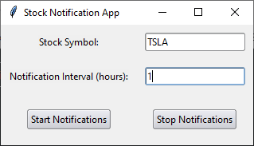
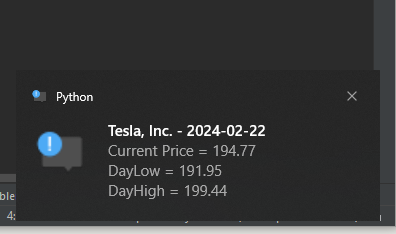

# Desktop-Stock-Notifier
The Stock Notification App allows users to set up notifications for a specific stock at regular intervals. It fetches real-time stock data using the Yahoo Finance API and displays notifications with the current price, day low, and day high.

